# Vault Librarian

An agent that lives in your Obsidian vault. Ask in plain language: it searches your notes with small tools, reads what it finds, answers with the lines it used, and changes a note only after you approve. It works the same on desktop and on your phone, with any model that speaks the OpenAI API: a local server, a company gateway or a commercial API.

<p align="center">
  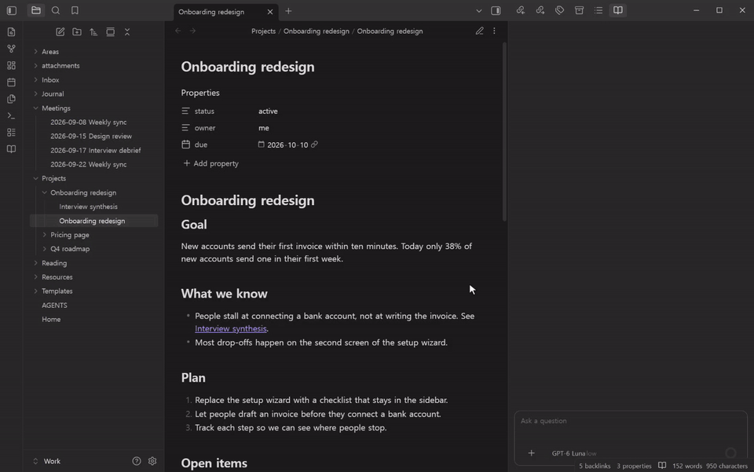
</p>

The full tour: a question and the steps behind its answer, two note changes approved on their cards, and a rewind that takes both back.

https://github.com/user-attachments/assets/55285424-031b-418f-a7f2-c402bc89d1e8

- [What you get](#what-you-get)
- [Get started](#get-started)
- [Commands](#commands)
- [Privacy](#privacy)
- [Development](#development)

## What you get

### Answers from the notes it read

There is no index to build or keep in sync. The agent looks around your vault the way a coding agent looks around a repository: `find` and `grep` to locate notes, `read` to open them, as many times as it needs. It answers from what it actually read and cites the lines as links, such as `Meetings/2026-09-15 Design review.md:11-18`. Select one to open the note at those lines. A `[[wikilink]]` in an answer opens in a new tab.

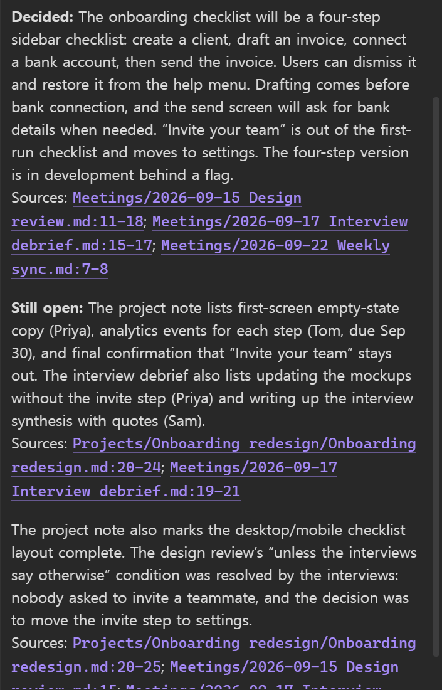

### Every step in view

Each request gets one work block. It reads **Working** while the agent works and folds into **Worked for** and the time it took. Unfold it for a timeline: the model's thinking, then each tool call as a chip, with calls that ran in parallel side by side. Select a chip to see its arguments and its result.

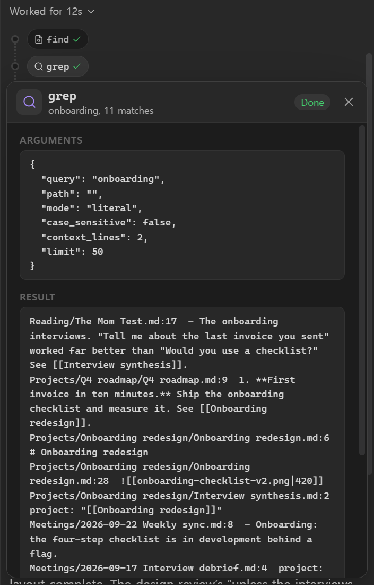

### Changes wait for your approval

Tools that only read run on their own, several at once. Anything that changes a note or a file, or runs a command, shows a card first: a new note with its full content, an edit as before and after. Approve it, reject it, or allow that tool from now on.

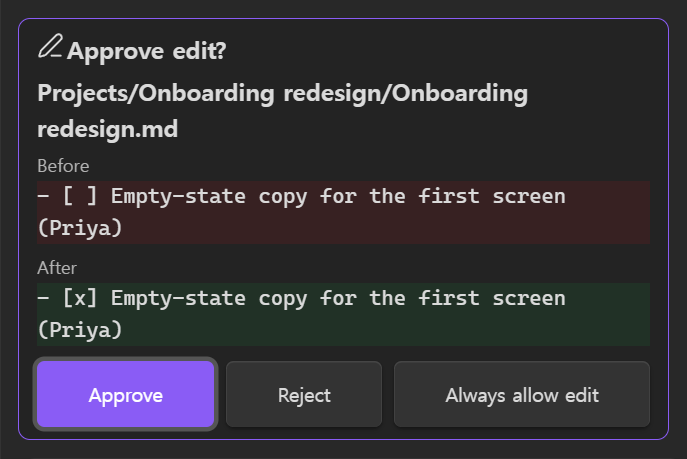

### Rewind a wrong turn

Go back to any earlier message. The turns after it collapse, and the notes the agent created or changed in that span go back to how they were. Notes you edited yourself in the meantime are left alone and listed. The message returns to the composer so you can word it differently.

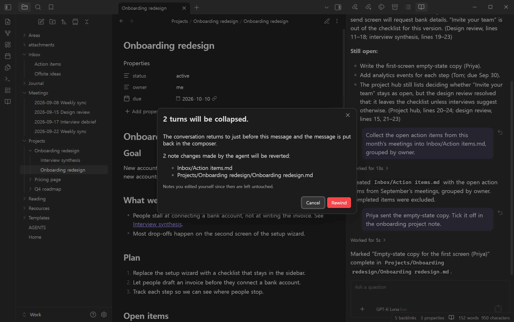

### On your phone too

The same plugin runs on iPhone, iPad and Android, and the phone talks to your model provider directly, with nothing to run on a computer. Sessions and settings are files in the plugin folder, so your vault's sync carries them to your other devices. While the agent works, the screen stays on; a request the phone cut off in the background carries on when you come back.

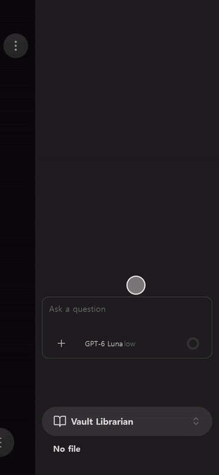

### A shell, the web and Obsidian commands

`bash` runs a shell inside Obsidian, not on your computer. The vault is its working folder, so `grep`, `sed`, `awk`, `jq` and the rest work on your notes. `curl` fetches any URL through Obsidian, with no CORS setup and the same on phones, and `obsidian` runs any Obsidian CLI command. Every `bash` call asks first by default, and the card shows the whole command.

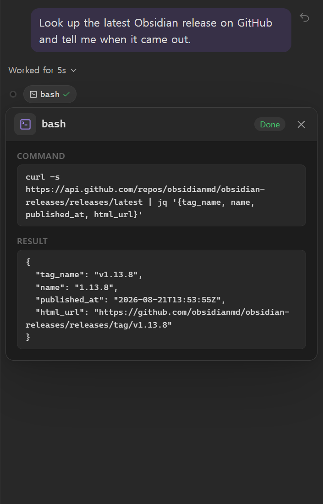

### Your rules

Each tool can be **Always allow**, **Ask first** or **Blocked**, one at a time or a whole group at once. A blocked tool is taken out of the model's tool list and refused again if it is called anyway. An `AGENTS.md` at the vault root is part of the agent's instructions, and so is the `AGENTS.md` of any folder it works in.

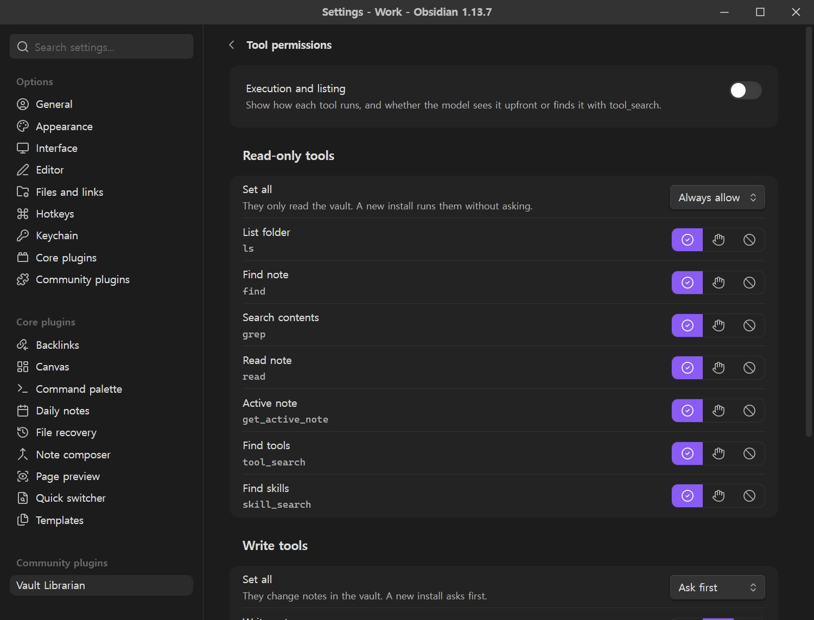

### And more

- **Skills.** Each `.agents/skills/<name>/SKILL.md` ([Agent Skills](https://agentskills.io) format), at the vault root or in any folder, is a skill. The model finds one with `skill_search` when a task calls for it, or you run it with `/skill <name>`. Add, edit and delete skills on the **Skills** settings page, or ask the agent to write one; every change the agent makes to a skill asks you first.
- **MCP servers.** Add remote MCP servers and sign in with OAuth or an API key. Tools that only read run on their own; every other tool asks first, and results are marked untrusted.
- **WebDAV storage.** Connect a NAS or any WebDAV server. The agent lists, reads, writes, moves and deletes files there, and copies files between the storage and the vault byte for byte.
- **Send while it works.** Messages you send during a run wait above the composer and go one at a time. **Send now** puts one in before the next tool call.
- **Sessions.** Every conversation is an append-only JSONL file, so it syncs with the vault and survives sync conflicts as a separate copy. Reopen, rename and delete them from the history.
- **Several sessions at once.** Start a new session or open another one while the agent works: the one at work keeps running. The head of the chat names the session it shows and counts the others that run or wait for you, a banner tells you when one of them asks for approval, and the history lists them on top with Stop. On desktop, open more chats as tabs; each keeps its session.
- **Context you can see.** The ring next to the send button shows how full the context window is, as the server reported it for the last response; hover or tap it for the numbers and the cache hit rate. Before the window fills, the conversation is compacted into a handoff summary that keeps your recent messages word for word, and the session file keeps the full record.
- **Images.** Paste a screenshot or attach a vault image when the model accepts images.
- **Set up once for every device.** A sync passphrase seals API keys, the WebDAV password and client secrets into the plugin's data file, so each device enters only the passphrase. Sign in to an MCP server on a computer, and your phone connects with that sign-in once the sync brings it, even where the server lets no phone sign in. **Export** and **Import** move all settings as one JSON file.
- **A short tool list.** The model sees `ls`, `find`, `grep`, `read`, `write`, `edit` and `bash` upfront. Other tools, such as the active note, WebDAV and MCP tools, load through `tool_search` when a task needs them, so their schemas stay out of every request.

The screens above come from a demo vault ([`docs/demo`](docs/demo)) with GPT-6 Luna; the phone is Obsidian's mobile layout.

## Get started

1. **Install.** In Obsidian, open **Settings → Community plugins → Browse**, search for **Vault Librarian**, then select **Install** and **Enable**.
2. **Add a provider.** Open **Settings → Vault Librarian → Providers** and select **Add provider**. Enter a name, the base URL of an OpenAI-compatible API (the part before `/chat/completions`) and your API key. For OpenAI's reasoning models, set **API** to **Responses**: they call tools while they reason only through `/responses`.

   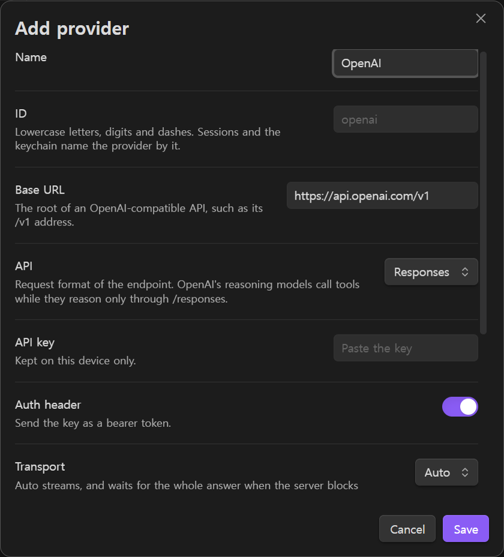

3. **Add a model.** Under **Models**, **Add from server** lists the models the server offers and fills in the context window, image input and reasoning where the server or Pi's model list knows them. **Add model** takes one by hand. The model needs tool calling. **Test** next to Connection checks the endpoint before you save.

   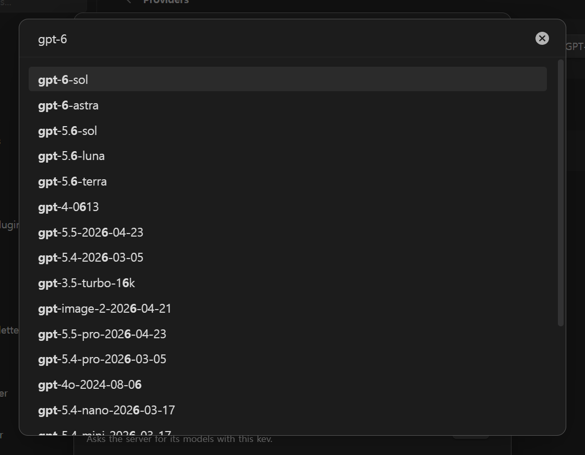

4. **Ask.** Open the chat from the ribbon icon or the **Open chat** command, and ask about your notes.

   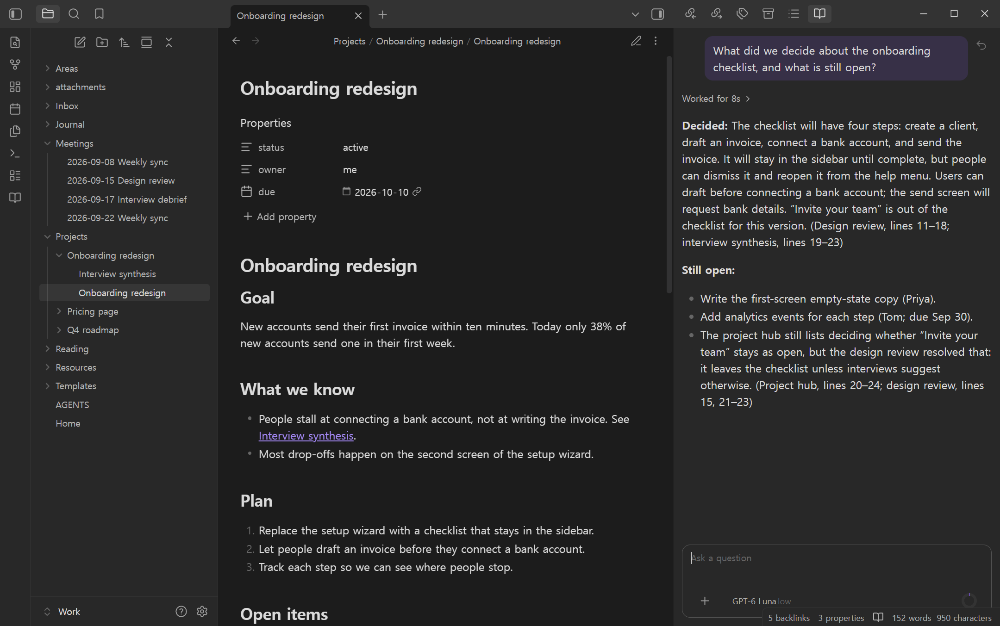

API keys are stored with Obsidian's `SecretStorage`, which is per device. On a new device the chat shows a banner asking for the key, and nothing is sent until it is set. With a sync passphrase under **Device sync**, keys also enter `data.json`, but only sealed (PBKDF2-SHA256 with 600,000 iterations and AES-256-GCM, the same format Google Calendar Tasks Sync uses), so a device without the passphrase cannot read them. MCP sign-ins travel sealed the same way, each device writing its own file under `signins` in the plugin folder, and a device that has a working sign-in keeps its own. Keys never enter the session files.

### Streaming and CORS

`fetch` streaming needs the server to allow the origins Obsidian uses: `app://obsidian.md` on desktop, `capacitor://localhost` on iOS, `http://localhost` on Android. If it does not, keep the transport on **Auto**: the first failed request switches the provider to Obsidian's `requestUrl` for the rest of the session. Or set the transport to **Non-streaming (Obsidian)** for good.

### Compatibility settings

OpenAI-compatible servers differ in the details. The provider and model editors expose the same compatibility flags as Pi's `models.json` (`supportsReasoningEffort`, `maxTokensField`, `thinkingFormat` and so on), and a model can use another API than its provider. Model-level values override provider-level ones.

## Commands

| Command | What it does |
| --- | --- |
| Open chat | Opens the chat, in the right sidebar unless **Open chat in** says otherwise (full screen on phones) |
| Open chat in right sidebar | Opens the chat in the right sidebar |
| Open chat in main area | Opens the chat as a tab |
| Open chat in new tab | Opens one more chat as a tab, on a new session |
| New session | Starts a new conversation; one at work keeps running |
| Open session history | Lists conversations, the ones at work on top |
| Compact context | Compacts the current conversation into a summary now |
| Add active note to prompt | Attaches the note you are viewing to your next message |

In the composer, `/` lists the slash commands: `/new`, `/history`, `/compact`, `/note`, `/model`, `/thinking`, `/skill`, `/settings` and `/help`. `@` attaches a note or a folder.

## Privacy

The plugin talks to the endpoints you configure: the model provider, and any MCP server or WebDAV storage you add. Note contents reach the model provider when the agent reads them, or when you attach a note or an image yourself. On a new install the tools that only read run without asking, so the agent can read notes it finds on its own, list and read the WebDAV storage, and call an MCP server's read tools with arguments it chose, such as a search query taken from your notes. Set the **Read-only tools** group, the **WebDAV storage** group or a server's group to **Ask first** to approve each call. Files reach the WebDAV storage only through the storage tools that change it, which ask first by default. The shell's `curl` is the exception: it sends a request to whatever URL the agent chooses, including URLs it found in notes or web pages, and a request can carry note contents. By default every `bash` call asks first, and its card shows the whole command, URL included. Set `bash` to **Always allow** only if you are comfortable with the agent browsing on its own: it then reaches any URL and runs any Obsidian command without asking. Header values such as `Authorization` are masked on screen but are sent as written and stay in the session file. There is no telemetry.

The `find` and `grep` tools enumerate Markdown notes to search the vault; a folder restriction narrows the search results. They run only after the tool's permission check (Always allow by default on a new install). Opening the image picker enumerates vault file paths locally so you can choose an image. It sends only the image you attach, not the complete file list. Vault enumeration is necessary for these features and may be reported on the community scorecard.

When enabled, the vault-root `AGENTS.md` is included in the system prompt sent to your configured endpoint. Search results can include note paths and excerpts. Signing in to an MCP server on desktop opens a listener on `127.0.0.1` for the few minutes the browser takes to come back, then closes it; on a phone the sign-in returns through an `obsidian://` link. No files outside the vault are read, except on the WebDAV storage you connect, and the temporary PNG that `obsidian dev:screenshot` has Obsidian write and the plugin then moves into the shell and deletes. A screenshot, like `dev:dom`, holds whatever the window shows. The shell sees the vault and its own scratch space, never the rest of your disk, and has no way to reach the network except through `curl`.

## Development

```bash
npm install
npm run dev      # watch build
npm run build    # type check and production bundle
npm run lint     # Biome and ESLint (eslint-plugin-obsidianmd)
npm test         # vitest
```

The agent loop is `@earendil-works/pi-agent-core`; the OpenAI-compatible adapter is `@earendil-works/pi-ai`. Both are pinned. Commits follow Conventional Commits (enforced by commitlint through prek) and releases are cut by release-please.

The media in this README are recorded from the demo vault in [`docs/demo`](docs/demo). After a UI change, `npm run build && node docs/demo/record.mjs` records them again; the script's header lists what it needs. The tour video at the top is `docs/media/tour.mp4` uploaded to GitHub by dropping it into an issue comment box, since a README plays only videos uploaded that way: upload the new file the same way and replace the address.

Found a bug or want something? [Open an issue](https://github.com/PubCyBerry/obsidian-vault-librarian/issues/new/choose).

## License

MIT
